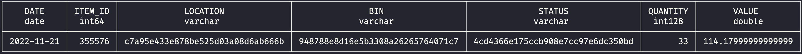

```
  ___   _   _______ _   _______ _____ _
 / _ \ | \ | |  _  \ | | | ___ \_   _| |
/ /_\ \|  \| | | | | | | | |_/ / | | | |
|  _  || . ` | | | | | | |    /  | | | |
| | | || |\  | |/ /| |_| | |\ \ _| |_| |____
\_| |_/\_| \_/___/  \___/\_| \_|\___/\_____/

```
`CONNER FERGUSON TAKE HOME ASSESSMENT`


---

## :books: Table of Contents

- [Approach](#-approach)
- [Answers](#white_check_mark-answers)
- [Next Steps](#next_track_button-next-steps)
- [Bibliography](#book-bibliography)

---

## 🎯 Approach

1. Align on data warehouse --> :duck: duckdb
1. Load data into warehouse (raw)
1. Data quality review
1. Model the data in :star: star schema
    1. Given that the data sets are fairly simple, build `VIEWS` on top of the RAW layer to handle for simple transformations
    1. Example transformations below :point_down:
        1. Convert `transaction_date` from a datetime to a date
        1. `ITEM.name` --> `ITEM.ITEM_NAME`
1. Build a fact table for inventory
    1. JOIN dimension VIEWS to it
1. Modify FACT_INVENTORY
    1. Calendar table
    1. Running total inventory table
1. Answer questions

---

## :white_check_mark: Answers

1. Do a data quality check – how does the data look? Are there any issues?

    1. `ITEM.name` can correspond to multiple `ITEM.id`
        1. specifically 34 `ITEM.name` correspond to multiple `ITEM.id`
    1. `cost` table has a number of peculiarities
        1. 12 items do not have costs associated with them due to missing `LOCATION_ID` in the `costs` table
            1. NULL values when joining the `cost` table to `transaction_line`
        1. 99% of records in the table get a date starting at the first of the month
            1. however, there are 4,110 instances of records that have a non-first day of the month cost
            1. not sure if this is an off cycle adjustment
                1. ex. item 314 at location 102 has a new cost on 2020-03-19
        1. Inconsistent costs - I'd need to better understand why there are such huge swings in costs here. Write-offs?
            1. ex. item 314 in location 101, goes from:
                1. 2020-08-01 --> 1388.37
                1. 2021-02-01 -->    0.37
                1. 2021-03-01 --> 1196.59
                1. 2021-04-01 -->    0.37
                1. 2021-05-01 --> 1374.37

2. What is the quantity, and location/bin/status combos of item 355576 on date 2022-11-21?



3. What is the total value of item 209372 on Date 2022-06-05?


4. What is the total value of inventory in Location c7a95e433e878be525d03a08d6ab666b on 2022-01-01?


5. Open Ended: Are there any interesting insights that you’d like to discuss?

- Snapshots:
    - From a modelling perspective, I think it'd be much easier from an analytics perspective to take nightly snapshots of the ending inventory postition for items
    - Rather than to build a daily view with code
- I'd like to better understand if there aren't certain transaction types that should be excluded from the analysis


---

## :next_track_button: Next Steps
- [x] refactor fact inventory to be more performant
    - [x] Remove NULL rows
    - [x] convert to table
- [ ] Model the data in dbt
- [ ] Set up daily (nightly) snapshots for inventory

---

## :book: Bibliography

- :video_camera: [DuckDB Tutorial For Beginners](https://www.youtube.com/watch?v=ZX5FdqzGT1E)
- :video_camera: [DuckDB Tutorial - DuckDB course for beginners](https://www.youtube.com/watch?v=AjsB6lM2-zw)
- :video_camera: [Ingesting #csv file from #github into #duckdb](https://www.youtube.com/shorts/49p4HyNFniE)
- :scroll: [Generate date ranges](https://gist.github.com/adityawarmanfw/0612333605d351f2f1fe5c87e1af20d2)

---